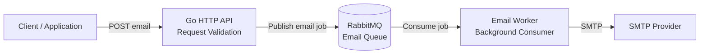

# Email Service

> **An API-first, asynchronous email delivery service built in Go, designed around decoupled message processing with RabbitMQ.**

Email Service started as a synchronous SMTP API and was refactored into a **producer-consumer architecture** where the API publishes email jobs to RabbitMQ and a background worker handles delivery independently.

The project focuses on backend engineering fundamentals: **asynchronous processing, service decoupling, dependency injection, clean package boundaries, configuration management, and extensibility.**

---

## Architecture



### Request Flow

1. A client sends an email request to the Go API.
2. The API validates the request and publishes an email job to RabbitMQ.
3. The API returns without waiting for SMTP delivery.
4. A background worker consumes the queued job.
5. The worker processes the email and delivers it through the configured SMTP server.

This separates **request handling from email delivery**, preventing slow SMTP operations from blocking API requests and allowing the worker layer to evolve independently.

---

## Why RabbitMQ?

A synchronous implementation tightly couples the HTTP request lifecycle to SMTP delivery:

```text
Client → API → SMTP → Response
```

The asynchronous architecture changes this to:

```text
Client → API → RabbitMQ → Worker → SMTP
                  ↑
             decoupled
```

This provides:

- **Non-blocking API requests** — the API does not wait for SMTP delivery.
- **Decoupling** — API and delivery workers can evolve independently.
- **Durable queuing** — email jobs can be held by the broker for asynchronous processing.
- **Independent scaling** — additional workers can be introduced as delivery volume grows.
- **Clear failure boundaries** — API availability is separated from SMTP processing.

---

## Key Engineering Decisions

### 1. Producer–Consumer Architecture

The API acts as a **producer**, while the email worker acts as a **consumer**.

This keeps the API focused on accepting and validating requests instead of performing delivery work.

### 2. Dependency Injection

External dependencies such as the queue and SMTP components are injected rather than tightly coupled to business logic.

This makes components easier to:

- Test
- Replace
- Extend
- Configure independently

### 3. Separation of Concerns

The codebase separates responsibilities across API handling, business logic, queue integration, worker processing, configuration, and SMTP delivery.

This keeps infrastructure concerns away from the core application flow.

### 4. Environment-Based Configuration

Runtime configuration is kept outside the source code using environment variables.

Typical configuration includes:

```env
SMTP_HOST=
SMTP_PORT=
SMTP_USERNAME=
SMTP_PASSWORD=

RABBITMQ_URL=
```

See `.env.example` for the expected configuration.

---

## Tech Stack

| Component | Technology |
|---|---|
| Language | **Go** |
| HTTP API | **Chi** |
| Message Broker | **RabbitMQ** |
| Email Delivery | **SMTP** |
| Configuration | **godotenv / Environment Variables** |
| Validation | **go-playground/validator** |
| Containerization | **Docker / Docker Compose** |

---

## Project Structure

```text
email-service/
│
├── cmd/
│   ├── api/                 # HTTP API entry point
│   └── worker/              # Background worker entry point
│
├── internal/
│   ├── config/              # Application configuration
│   ├── handlers/            # HTTP handlers
│   ├── services/            # Business logic
│   ├── queue/               # RabbitMQ integration
│   ├── smtp/                # SMTP delivery
│   └── models/              # Request/domain models
│
├── pkg/                     # Shared utilities/interfaces
│
├── docker-compose.yml
├── .env.example
└── README.md
```

> The exact directory structure may vary with the current implementation; the important design principle is keeping API, queue, worker, and SMTP responsibilities separated.

---

## API

### Send Email

```http
POST /emails
Content-Type: application/json
```

Example request:

```json
{
  "to": "user@example.com",
  "subject": "Welcome!",
  "body": "Welcome to the platform."
}
```

The API validates the request and publishes the email as a background job instead of performing SMTP delivery inline.

---

## Running Locally

### 1. Clone the repository

```bash
git clone <your-repository-url>
cd email-service
```

### 2. Configure environment variables

```bash
cp .env.example .env
```

Fill in the RabbitMQ and SMTP configuration.

### 3. Start dependencies

```bash
docker compose up -d
```

### 4. Run the API

```bash
go run ./cmd/api
```

### 5. Run the worker

In another terminal:

```bash
go run ./cmd/worker
```

The API and worker can also be containerized and run together using Docker Compose, depending on the repository configuration.

---

## From Synchronous to Asynchronous

One of the main engineering improvements in this project was moving from direct SMTP delivery:

```text
HTTP Request
     │
     ▼
   API
     │
     ▼
   SMTP
     │
     ▼
  Response
```

to an asynchronous architecture:

```text
HTTP Request
     │
     ▼
   API
     │
     ▼
 RabbitMQ
     │
     ▼
  Worker
     │
     ▼
   SMTP
```

The result is a cleaner separation between **accepting work** and **executing work**.

---

## Reliability & Scalability

The current architecture provides the foundation for a more robust delivery platform:

```text
                ┌─────────────┐
                │    Client   │
                └──────┬──────┘
                       │
                       ▼
                ┌─────────────┐
                │   Go API    │
                └──────┬──────┘
                       │
                       ▼
                ┌─────────────┐
                │  RabbitMQ   │
                └──────┬──────┘
                       │
              ┌────────┴────────┐
              ▼                 ▼
        ┌───────────┐     ┌───────────┐
        │  Worker 1 │     │  Worker N │
        └─────┬─────┘     └─────┬─────┘
              │                 │
              └────────┬────────┘
                       ▼
                 ┌──────────┐
                 │   SMTP   │
                 └──────────┘
```

Workers can be scaled independently from the API layer as workload increases.

---

## Future Improvements

The architecture is intentionally designed to support additional capabilities:

- Retry policies and Dead Letter Queues
- Email delivery status tracking
- Scheduled email delivery
- HTML templates and dynamic data
- Attachments
- Bulk email processing
- Rate limiting
- API key / JWT authentication
- Multiple SMTP/email providers
- Provider failover
- Webhooks
- PostgreSQL / Redis integration
- Worker pools
- Kubernetes deployment
- Prometheus + Grafana monitoring
- OpenTelemetry tracing
- Swagger / OpenAPI documentation
- Multi-tenancy
- Admin dashboard

These are **planned extensions**, not features claimed as currently implemented.

---

## What This Project Demonstrates

**Backend Engineering**
- REST API design
- Request validation
- Dependency injection
- Modular Go architecture

**Distributed Systems**
- Asynchronous processing
- Message queues
- Producer-consumer patterns
- Service decoupling
- Independent worker scaling

**Infrastructure**
- RabbitMQ
- Docker
- Docker Compose
- Environment-based configuration

**Software Design**
- Separation of concerns
- Interface-driven dependencies
- Extensible service boundaries
- Evolution from synchronous to asynchronous architecture

---

## License

This project is open source and available under the terms of the repository's license.
